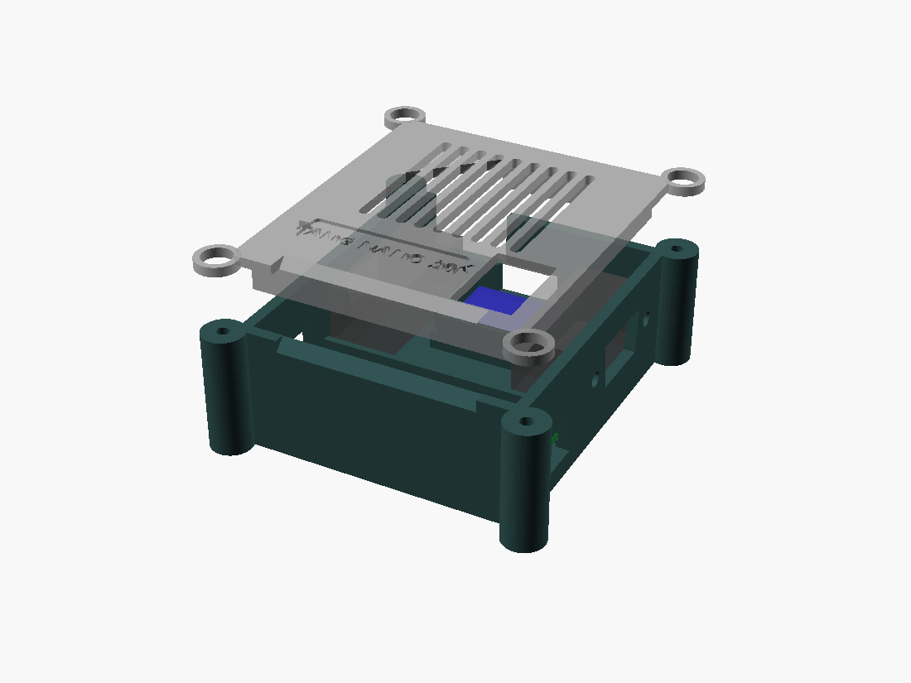
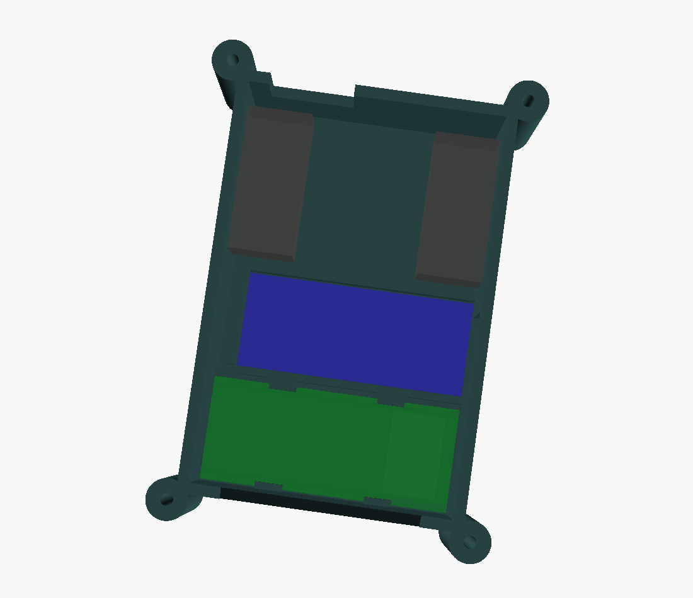
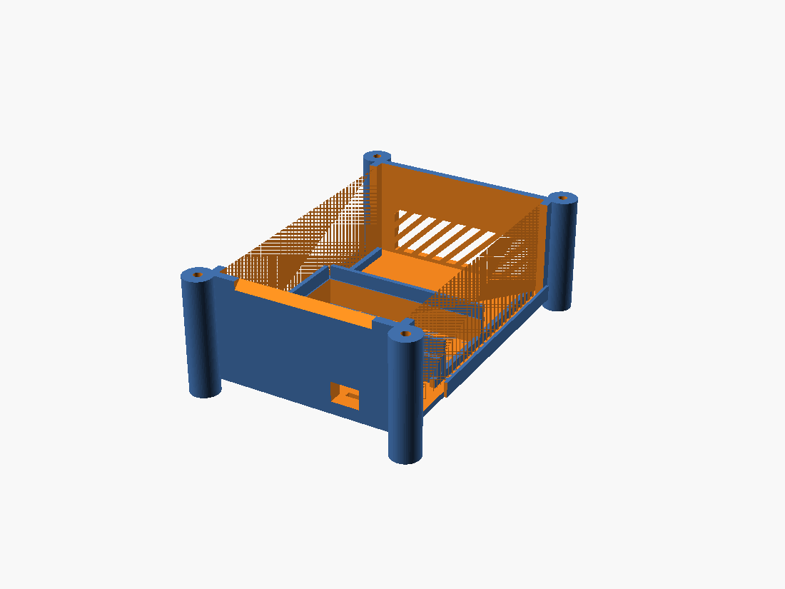
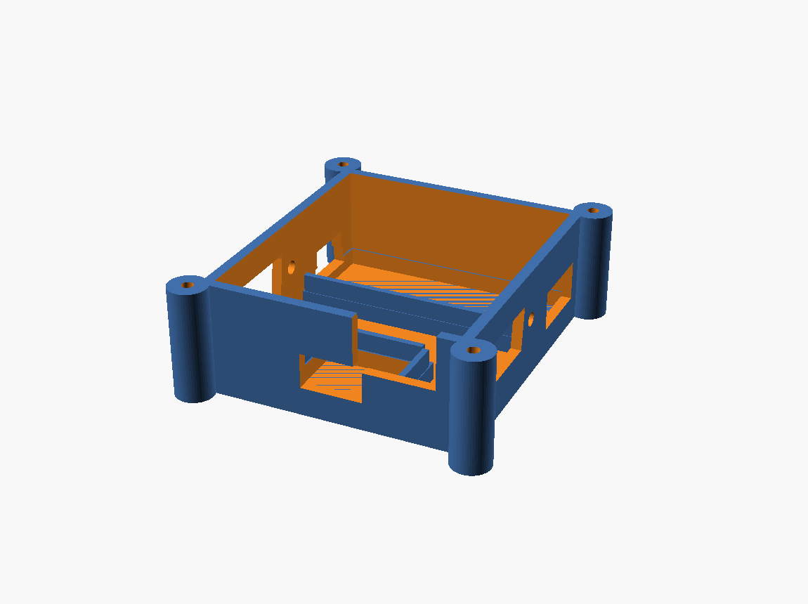
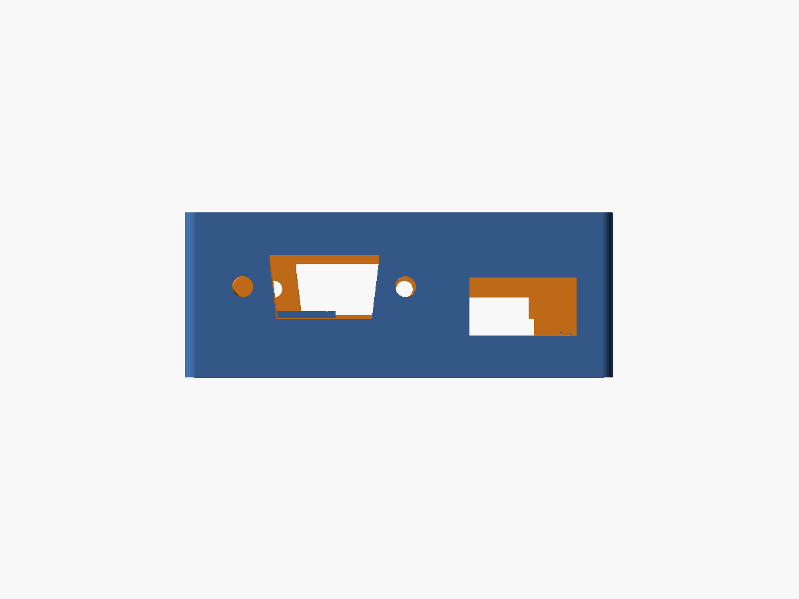
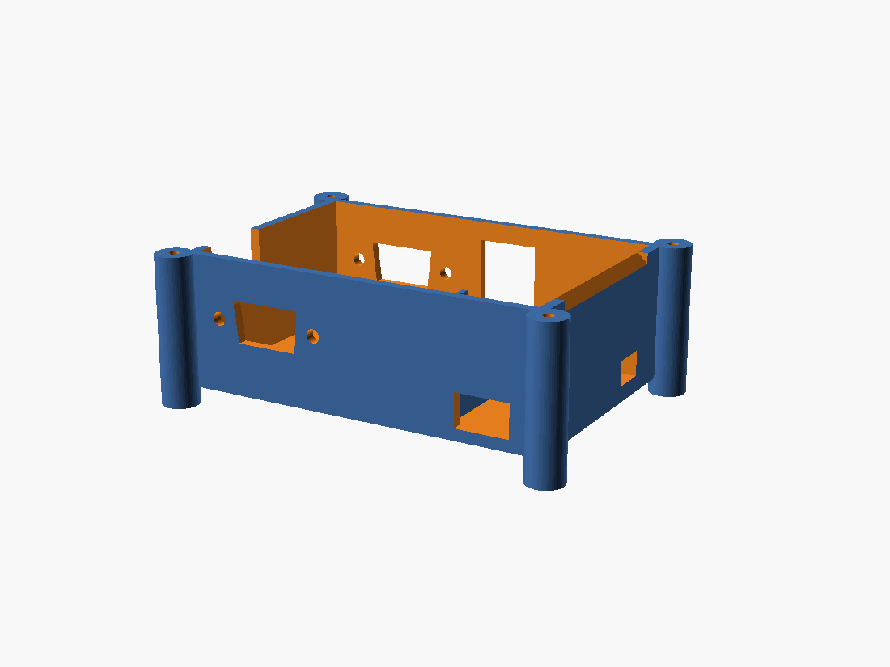
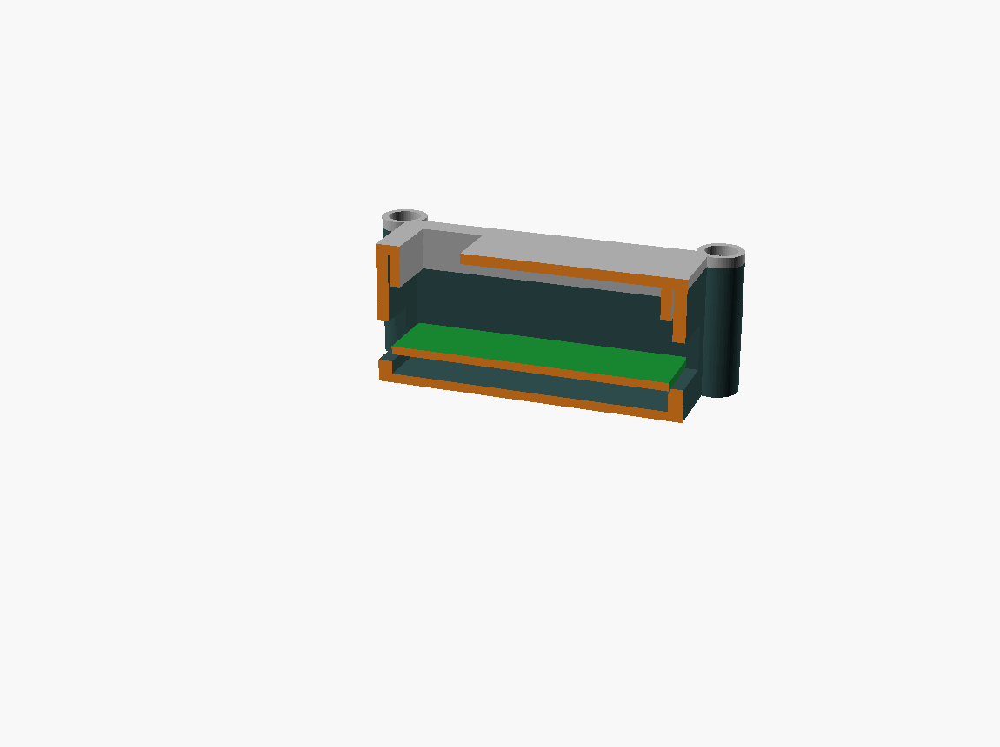
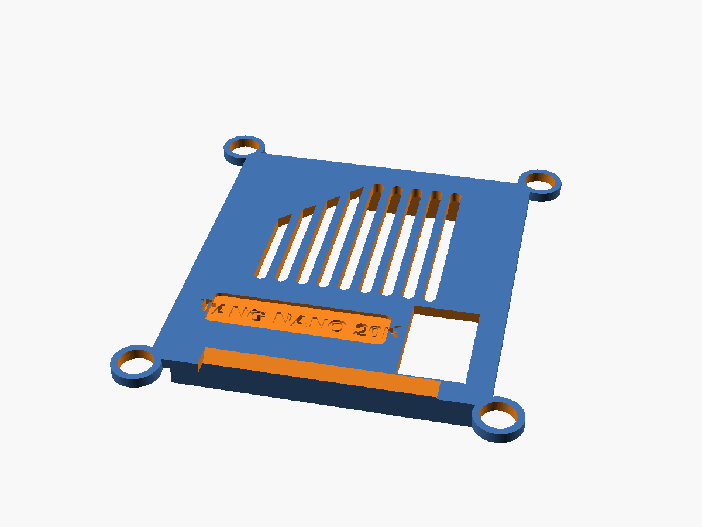
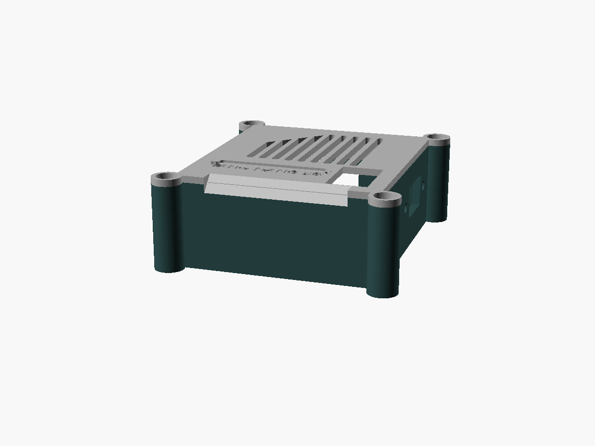

# 3D-printed case — Tang Nano 20K + CH9350

A parametric, two-part enclosure for this project's hardware: a **Sipeed Tang
Nano 20K** plus a **CH9350 USB-host keyboard module**, wired as in the main
[README](../README.md) (one data wire to Pin 53, GND + 5 V, DB9 joysticks on
GPIO pins).

| | |
|---|---|
|  |  |
| Exploded preview (lid floating) | Top-down plan (lid off): Tang front, CH9350 centred back, DB9 bodies on the sides |
|  |  |
| Base tray | Rear 3/4: USB-A + cable notch (back wall), DB9 on each side |
|  |  |
| Side elevation: DB9 port (rear) + HDMI & microSD (front) | Side 3/4: DB9 port detail |
|  |  |
| Cutaway: PCB on the shelf, standoff gap below, headroom + closed lid above | Lid: single row of 45° ventilation slots |
|  | |
| Closed case | |

## What's here

```
case/
├── tang_nano_20k_ch9350_case.scad   # the parametric model (edit this)
├── stl/
│   ├── base.stl       # the tray that holds both boards
│   ├── lid.stl        # snap-in lid (LED window + S1/S2 button holes)
│   └── fitcheck.stl   # thin test frame — PRINT THIS FIRST
└── img/               # rendered previews
```

## ⚠️ Read this first — these are datasheet dimensions, not a measured fit

I cannot physically measure your boards, so the model is built from published
dimensions:

| Board | Size used | Source |
|-------|-----------|--------|
| Tang Nano 20K | 54.04 × 22.55 × 1.6 mm | Sipeed datasheet |
| CH9350 module | 22.0 × 17.0 × 1.6 mm | module listings |

The **exact positions of the connectors, the S1/S2 buttons and the LEDs vary**
between board revisions and CH9350 vendors. So:

1. **Print `fitcheck.stl` first.** It's just the floor + low walls + the board
   shelves + the connector cutouts (~10–15 min, little plastic). Drop your
   boards in and check that the HDMI / USB-C / microSD / USB-A openings line up.
2. Adjust the variables at the top of the `.scad` (every dimension is one), then
   re-export and print the real `base.stl` + `lid.stl`.

The connector openings are intentionally a little generous; the parameters
flagged `ESTIMATE, calibrate` (button + LED window positions) are the most
likely to need nudging.

## Layout

Both boards lie flat in one tray:

- **Tang Nano 20K** along the front. **HDMI** exits the left short wall; **USB-C
  power** and the **microSD slot** exit the right short wall; **S1/S2** are
  reached through holes in the lid; the 4 status **LEDs** show through a window
  in the lid.
- **CH9350** sits in the rear bay, centred against the back wall; its **USB-A**
  port (where you plug the keyboard) exits the back wall.
- **DB9 joystick ports** — one panel-mount female D-sub on each short side wall
  (left = Joystick 1 / HDMI end, right = Joystick 2 / USB-C end), in the rear
  bay. Each is a D-shaped aperture plus two 24.99 mm-pitch screw holes. The
  connector bodies protrude inward into the rear bay; the CH9350 is centred so
  they clear it.
- A small **cable-exit notch** in the back wall corner is handy for the
  GND / 5 V / Pin-53 wires (or any external wiring).

Boards rest on a 4 mm perimeter shelf (clears the underside microSD slot and
solder joints) and are located by thin ribs (no board mounting holes are
needed, and the Tang Nano 20K has none anyway). See the **cutaway** above for
how the PCB, standoff gap, headroom and lid stack up.

The lid **screws down** with **4 × M3 self-tapping screws** into four external
corner lugs (the interior is too packed for internal posts). The base lugs have
pilot holes; the lid lugs have counterbored clearance holes so the heads sit
flush. A perimeter lip also locates the lid. Screws ~12–16 mm long; or use
machine screws into heat-set inserts (open up `screw_pilot_d` to the insert
bore). Set `screw_enable = false` to drop the lugs and use the lip as a plain
friction fit.

Outer size with defaults: **box ≈ 60 × 66 × 27 mm**, **≈ 72 × 78 mm including
the corner lugs** (turn DB9 off with `db9_enable = false` for a ~60 × 48 box).

### DB9 joystick ports — wiring & parts

You supply **two panel-mount female DB9 connectors** (solder-cup type) and four
M3 (or #4-40) screws + nuts. Mount each socket from the inside, screw it to the
side wall, and wire its pins to the GPIO header per the main
[README joystick table](../README.md#atari-db9-joystick):

```
DB9 pin 1 Up    DB9 pin 3 Left   DB9 pin 4 Right   DB9 pin 6 Fire   DB9 pin 8 GND
Joy1 -> pins 27 / 28 / 29 / 30 / 31     Joy2 -> pins 32 / 41 / 42 / 48 / 77
```

All active-low; no resistors (internal FPGA pull-ups). Don't wire pin 7 (+5 V).
Don't print DB9 ports you won't populate — set `db9_enable = false` for the
smaller keyboard-only case.

## Key parameters to tune

Open `tang_nano_20k_ch9350_case.scad` — everything is at the top:

| Variable | Meaning | When to change |
|----------|---------|----------------|
| `headroom` | clear height above the Tang PCB | **lower to ~8–10** if you don't have tall pin headers + Dupont wires; raise for chunky connectors |
| `standoff` | gap under the boards | increase if underside parts are tall |
| `clear` | XY fit slack around boards | loosen/tighten the board fit |
| `hdmi_*`, `usbc_*`, `sd_*`, `usba_*` | connector opening size/position | align to your board |
| `btn1_x/y`, `btn2_x/y` | S1/S2 lid holes | move over your actual buttons |
| `led_win_*` | LED window | resize/move over your LED row |
| `cable_slot_*` | rear wire-exit notch | widen / reposition for your wiring |
| `lip_clear` | lid-to-base fit | increase if the lid is too tight to close |
| `db9_enable` | DB9 joystick ports on/off | `false` = compact keyboard-only case |
| `db9_zone` | rear-bay depth | grow if your connector bodies are deep |
| `db9_apt_w/_w2/_h` | DB9 D-aperture size | match your connector shell |
| `db9_screw_pitch`, `db9_screw_d` | DB9 mount holes | 24.99 mm is standard; set screw dia |
| `db9_z_frac`, `db9_y_off` | DB9 position on the wall | centre the ports to taste |
| `screw_enable` | corner screw lugs on/off | `false` = friction-fit lid (no lugs) |
| `screw_pilot_d` | base pilot-hole dia | 2.6 mm = M3 self-tap; widen for inserts |
| `screw_clear_d`, `screw_head_d/_h` | lid hole + counterbore | match your screw heads |
| `lug_r`, `lug_off` | lug size / how far it sits out | shrink to reduce footprint |
| `vent_enable` | top ventilation field | turn the slot field on/off |
| `vent_x0/x1`, `vent_y0/y1` | field extent (X width, Y front/rear) | size + position the field |
| `vent_slot_w`, `vent_pitch` | slot width / spacing | tune the look |
| `vent_diag` | size of the diagonal smooth corner | 0 = square field; larger = bigger 65XE-style chamfer |
| `front_bevel`, `front_inset` | sloped front-top chamfer / keep-out from lugs | 0 = square front edge |
| `brand_enable`, `brand_text` | recessed front label strip + text | **use your own text — avoid trademarks** |
| `brand_cx/_cy`, `brand_w/_h`, `brand_depth`, `brand_txt_sz` | strip position / size / depth / text size | tune the label |

## Printing

| Setting | Suggestion |
|---------|------------|
| Material | PLA or PETG |
| Layer height | 0.2 mm |
| Walls / perimeters | 3 |
| Infill | 15–20 % |
| Supports | **none needed** — both parts print flat (base floor-down, lid plate-down) |
| Orientation | base: cavity up; lid: top plate **on the bed** (lip + lugs up) so the counterbores print clean |
| Hardware | 4 × M3 self-tapping screws ~12–16 mm (optional: heat-set inserts) |

## Re-generating the STLs

Requires [OpenSCAD](https://openscad.org/).

```bash
cd case
openscad -D 'part="base"'     -o stl/base.stl     tang_nano_20k_ch9350_case.scad
openscad -D 'part="lid"'      -o stl/lid.stl      tang_nano_20k_ch9350_case.scad
openscad -D 'part="fitcheck"' -o stl/fitcheck.stl tang_nano_20k_ch9350_case.scad
```

Preview parts (no STL): `part="assembly"` (exploded, `show_lid=false` drops the
lid), `part="section"` (cutaway through the Tang, lid closed), `part="closed"`
(finished case). Open the `.scad` in the OpenSCAD GUI to tweak interactively.

The lid top has a **65XE-style field of long ventilation slots** near the rear,
with one corner cut on a diagonal (the smooth triangle on the real machine).
They are through-cut, so they print clean lid-face-down. Resize/relocate with
the `vent_*` parameters (`vent_diag = 0` for a plain square field).

Two more 65XE nods: a **sloped (chamfered) front-top edge** (`front_bevel`) and
a **recessed brand strip** on the front (`brand_*`) with debossed text. The text
defaults to `TANG NANO 20K` — **set `brand_text` to your own wording and avoid
the Atari trademark/Fuji**. Both features are debossed/through and print clean
with the lid face-down. (The `front_bevel` is intentionally modest so it clears
the front LED window; increase it if you move the window.)

## Notes & ideas

- The boards have no mounting holes; they're held by the perimeter shelf +
  locating ribs and clamped by the closed lid.
- DB9 ports are full panel-mount sockets (D-aperture + screw holes). If you'd
  rather just route bare joystick wires out, set `db9_enable = false` and widen
  `cable_slot_w`.
- Want a hinged or snap-fit lid, vent slots, or panel-mount sockets for power
  instead of bare USB-C — ask and I can extend the model.
