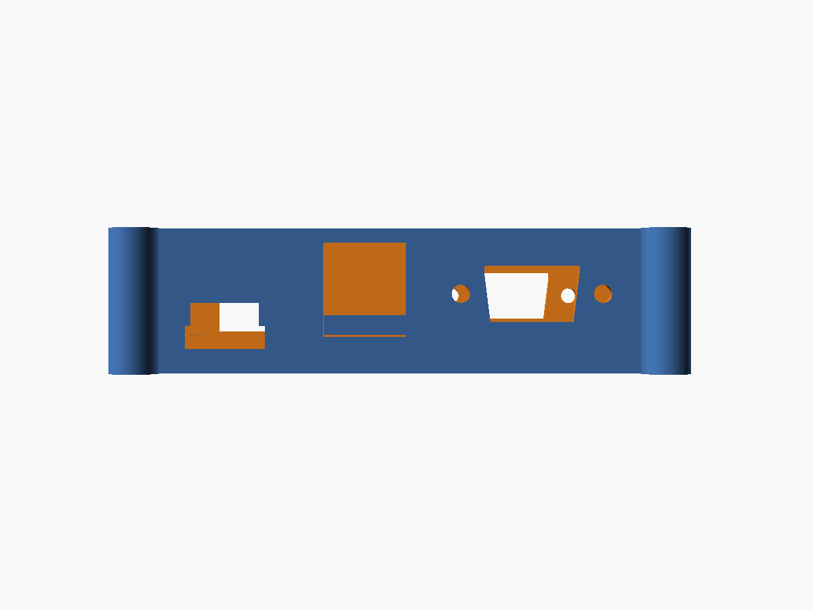

# 3D-printed case — Tang Nano 20K + CH9350

A parametric, two-part enclosure for this project's hardware: a **Sipeed Tang
Nano 20K** plus a **CH9350 USB-host keyboard module**, wired as in the main
[README](../README.md) (one data wire to Pin 53, GND + 5 V, DB9 joysticks on
GPIO pins).

| | |
|---|---|
|  |  |
| Exploded preview (lid floating) | Top-down (lid off): Tang front, CH9350 middle, DB9 bodies in the rear bay |
|  |  |
| Base tray | +X wall: USB-C/SD (front), dual-USB stack (middle), DB9 (rear) |
|  |  |
| −X wall: HDMI **low** (front) + DB9 (rear) — Tang is component-side-down | Side 3/4: DB9 port detail |
|  |  |
| Cutaway: connector gap below the PCB, pins-up headroom above, closed lid | Lid: 65XE-style top (vent band / brand strip / Fuji) — a plain cover now |
|  | |
| Closed case | |

## What's here

```
case/
├── tang_nano_20k_ch9350_case.scad   # the parametric model (edit this)
├── stl/
│   ├── base.stl       # the tray that holds both boards (LED window + S1/S2
│   │                  #   button holes are in the FLOOR; capture clips + feet)
│   ├── lid.stl        # screw-down lid — plain cover (vents + branding)
│   └── fitcheck.stl   # thin test frame — PRINT THIS FIRST
└── img/               # rendered previews
```

## ⚠️ Read this first — these are datasheet dimensions, not a measured fit

I cannot physically measure your boards, so the model is built from published
dimensions:

| Board | Size used | Source |
|-------|-----------|--------|
| Tang Nano 20K | 54.04 × 22.55 × 1.6 mm | Sipeed datasheet |
| CH9350 module | 49.6 × 20.5 × 1.6 mm, **stacked dual USB-A** on one short end | measured |

The **exact positions of the connectors, the S1/S2 buttons and the LEDs vary**
between board revisions and CH9350 vendors. So:

1. **Print `fitcheck.stl` first.** It's the floor + low walls + the board
   shelves + capture clips + connector cutouts (~10–15 min, little plastic).
   Drop the Tang in **pins-up** and check: it snaps under the clips, the HDMI /
   USB-C openings (now low on the walls) and the microSD slot line up, and the
   floor button/LED holes sit under S1/S2 and the LEDs.
2. Adjust the variables at the top of the `.scad` (every dimension is one), then
   re-export and print the real `base.stl` + `lid.stl`.

The connector openings are intentionally a little generous; the parameters
flagged `ESTIMATE, calibrate` (button + LED positions) and `clip_ov` (the clip
overhang vs. the header rows) are the most likely to need nudging. **Note:** the
default button/LED positions are estimates and currently overlap — set them from
your actual board before printing the final base.

## Layout

Both boards lie flat in one tray, stacked front-to-back:
**Tang (front) → CH9350 (middle) → DB9 bay (rear)**.

### Tang Nano 20K is mounted component-side **down** (pins **up**)

This is the important bit. The Tang's GPIO header pins (where the Dupont jumpers
to the CH9350 / DB9 / power go) are on one face; the connectors, buttons and LEDs
are on the other. To wire jumpers comfortably, the board sits **pins-up**, so the
**component side faces the floor**. Consequences:

- **GPIO pins point up** into the headroom — easy to plug/route jumpers. (The win.)
- **HDMI** (−X wall) and **USB-C** (+X wall) hang *below* the PCB, so their
  openings sit **low on the walls**, just above the floor.
- **microSD** is on the Tang's opposite face, so it flips to the **top** and its
  slot sits just **above** the PCB on the +X wall.
- **S1/S2 buttons** and the **status LEDs** face down → **poke-holes and a
  viewing window in the base FLOOR**. Four **feet** lift the case so they clear
  the desk (and the LEDs are visible).
- **CH9350** stays component-side-up; its **stacked dual USB-A** (keyboard) exits
  the **+X wall** above the board. So the +X wall carries USB-C + SD (front),
  the dual-USB (middle) and a DB9 (rear), spaced along its length.
- **DB9 joystick ports** — one panel-mount female D-sub on each side wall in the
  **rear bay** behind the CH9350 (left = Joystick 1, right = Joystick 2). Each is
  a D-shaped aperture + two 24.99 mm-pitch screw holes; bodies protrude into the
  empty rear bay.
- A small **cable-exit notch** in the back wall is handy for the
  GND / 5 V / Pin-53 wires.

### How the boards are held

The Tang is **captured in the base**, not the lid: it rests on two long-edge
shelves and is held down by **clips that hook over its top edge**. Pressing a
floor button drives the board *up into the clips*, so it can't pop out. The
clips are placed to dodge the board features:

- **Long-edge clips** (`clip_x`, default `[10, 30]` mm from the HDMI end) stay in
  the HDMI half — rigid hooks off the front wall, flexible fingers at the back —
  clear of S1/S2 and the LED row, which are all at the USB-C end.
- **USB-C-end hooks** (`clip_end`) hold the *button end* down via two small hooks
  off the +X wall at the corners, missing the centred SD slot and not touching
  S1/S2 (which sit ~3 mm inboard and below, in the floor).

**Calibrate `clip_ov`** (and the positions above) to your board — the hooks must
grab bare PCB edge and clear the header rows. The CH9350 rests on a perimeter
shelf with locating ribs. See the **cutaway** for the connector-gap-below /
pins-up-headroom-above stack.

The lid **screws down** with **4 × M3 self-tapping screws** into four external
corner lugs (the interior is too packed for internal posts). The base lugs have
pilot holes; the lid lugs have counterbored clearance holes so the heads sit
flush. A perimeter lip also locates the lid. Screws ~12–16 mm long; or use
machine screws into heat-set inserts (open up `screw_pilot_d` to the insert
bore). Set `screw_enable = false` to drop the lugs and use the lip as a plain
friction fit.

Outer size with defaults: **box ≈ 60 × 90 × 31 mm** (~35 mm on its feet),
**≈ 72 × 102 mm including the corner lugs**. The depth comes from the three
stacked zones + rear DB9 bay; the height grew because the connector gap below
the PCB plus the pins-up headroom now stack on opposite faces. Turn DB9 off with
`db9_enable = false` for a shorter box.

### DB9 joystick ports — wiring & parts

You supply **two panel-mount female DB9 connectors** (solder-cup type) and four
M3 (or #4-40) screws + nuts. Mount each socket from the inside, screw it to the
side wall, and wire its pins to the GPIO header per the main
[README joystick table](../README.md#atari-db9-joystick):

```
DB9 pin 1 Up    DB9 pin 3 Left   DB9 pin 4 Right   DB9 pin 6 Fire   DB9 pin 8 GND
Joy1 -> pins 27 / 28 / 29 / 30 / 31     Joy2 -> pins 32 / 41 / 42 / 48 / 77
```

All active-low; no resistors (internal FPGA pull-ups). Don't wire pin 7 (+5 V).
Don't print DB9 ports you won't populate — set `db9_enable = false` for the
smaller keyboard-only case.

## Key parameters to tune

Open `tang_nano_20k_ch9350_case.scad` — everything is at the top:

| Variable | Meaning | When to change |
|----------|---------|----------------|
| `headroom` | clear height above the Tang PCB | **lower to ~8–10** if you don't have tall pin headers + Dupont wires; raise for chunky connectors |
| `standoff` | gap under the boards | increase if underside parts are tall |
| `clear` | XY fit slack around boards | loosen/tighten the board fit |
| `hdmi_*`, `usbc_*`, `sd_*`, `usba_*` | connector opening size/position | align to your board |
| `btn1_x/y`, `btn2_x/y` | S1/S2 lid holes | move over your actual buttons |
| `led_win_*` | LED window | resize/move over your LED row |
| `cable_slot_*` | rear wire-exit notch | widen / reposition for your wiring |
| `lip_clear` | lid-to-base fit | increase if the lid is too tight to close |
| `db9_enable` | DB9 joystick ports on/off | `false` = compact keyboard-only case |
| `db9_zone` | rear-bay depth | grow if your connector bodies are deep |
| `db9_apt_w/_w2/_h` | DB9 D-aperture size | match your connector shell |
| `db9_screw_pitch`, `db9_screw_d` | DB9 mount holes | 24.99 mm is standard; set screw dia |
| `db9_z_frac`, `db9_y_off` | DB9 position on the wall | centre the ports to taste |
| `screw_enable` | corner screw lugs on/off | `false` = friction-fit lid (no lugs) |
| `screw_pilot_d` | base pilot-hole dia | 2.6 mm = M3 self-tap; widen for inserts |
| `screw_clear_d`, `screw_head_d/_h` | lid hole + counterbore | match your screw heads |
| `lug_r`, `lug_off` | lug size / how far it sits out | shrink to reduce footprint |
| `vent_enable` | rear diagonal vent band | turn the slot band on/off |
| `vent_margin`, `vent_rear_gap`, `vent_band_h` | band inset / rear gap / height | size + position the band |
| `vent_slot_w`, `vent_pitch`, `vent_angle` | slot width / spacing / angle | tune the look (default 45°) |
| `brand_enable`, `brand_text` | recessed brand strip + text | the label wording |
| `brand_cx/_cy`, `brand_w/_h`, `brand_depth`, `brand_txt_sz` | strip position / size / depth / text size | tune the label (`brand_cx=0` auto-centres) |
| `logo_enable`, `logo_raised` | Fuji logo | `raised` embosses (else debossed) |
| `logo_w/_h`, `logo_cx/_cy`, `logo_depth` | logo size / position / depth | move + scale (`logo_cx=0` auto-centres) |
| `front_bevel`, `front_inset` | sloped front-top chamfer / keep-out from lugs | 0 = square front edge |

## Printing

| Setting | Suggestion |
|---------|------------|
| Material | PLA or PETG |
| Layer height | 0.2 mm |
| Walls / perimeters | 3 |
| Infill | 15–20 % |
| Supports | **none needed** — both parts print flat (base floor-down, lid plate-down) |
| Orientation | base: cavity up; lid: top plate **on the bed** (lip + lugs up) so the counterbores print clean |
| Hardware | 4 × M3 self-tapping screws ~12–16 mm (optional: heat-set inserts) |

## Re-generating the STLs

Requires [OpenSCAD](https://openscad.org/).

```bash
cd case
openscad -D 'part="base"'     -o stl/base.stl     tang_nano_20k_ch9350_case.scad
openscad -D 'part="lid"'      -o stl/lid.stl      tang_nano_20k_ch9350_case.scad
openscad -D 'part="fitcheck"' -o stl/fitcheck.stl tang_nano_20k_ch9350_case.scad
```

Preview parts (no STL): `part="assembly"` (exploded, `show_lid=false` drops the
lid), `part="section"` (cutaway through the Tang, lid closed), `part="closed"`
(finished case). Open the `.scad` in the OpenSCAD GUI to tweak interactively.

The lid top mimics the **Atari 65XE** layout (rear → front): a **diagonal vent
band**, an **"ATARI 800" brand strip**, a **Fuji logo**, and the **LED window**,
with a **sloped (chamfered) front-top edge**. The vents are through-cut and the
brand/logo are debossed, so it all prints clean lid-face-down. Tune with the
`vent_*`, `brand_*`, `logo_*` and `front_bevel` parameters.

> **Trademark note:** "ATARI", "ATARI 800" and the Fuji logo are Atari's
> trademarks. This styling is for a **personal build**. Don't sell or
> redistribute the model or prints. To make it shareable, set
> `brand_text` to neutral wording and `logo_enable = false`.

## Notes & ideas

- The boards have no mounting holes; they're held by the perimeter shelf +
  locating ribs and clamped by the closed lid.
- DB9 ports are full panel-mount sockets (D-aperture + screw holes). If you'd
  rather just route bare joystick wires out, set `db9_enable = false` and widen
  `cable_slot_w`.
- Want a hinged or snap-fit lid, vent slots, or panel-mount sockets for power
  instead of bare USB-C — ask and I can extend the model.
