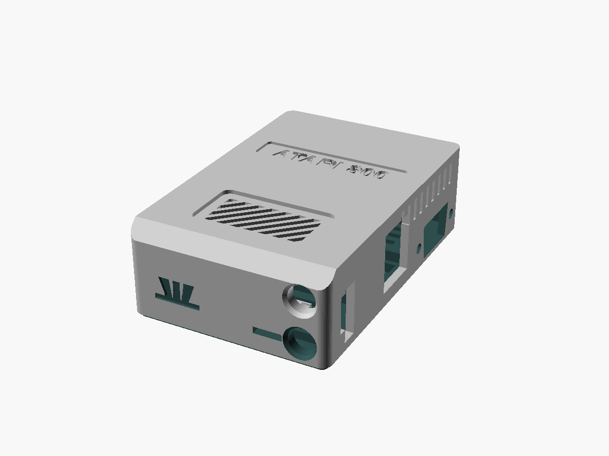
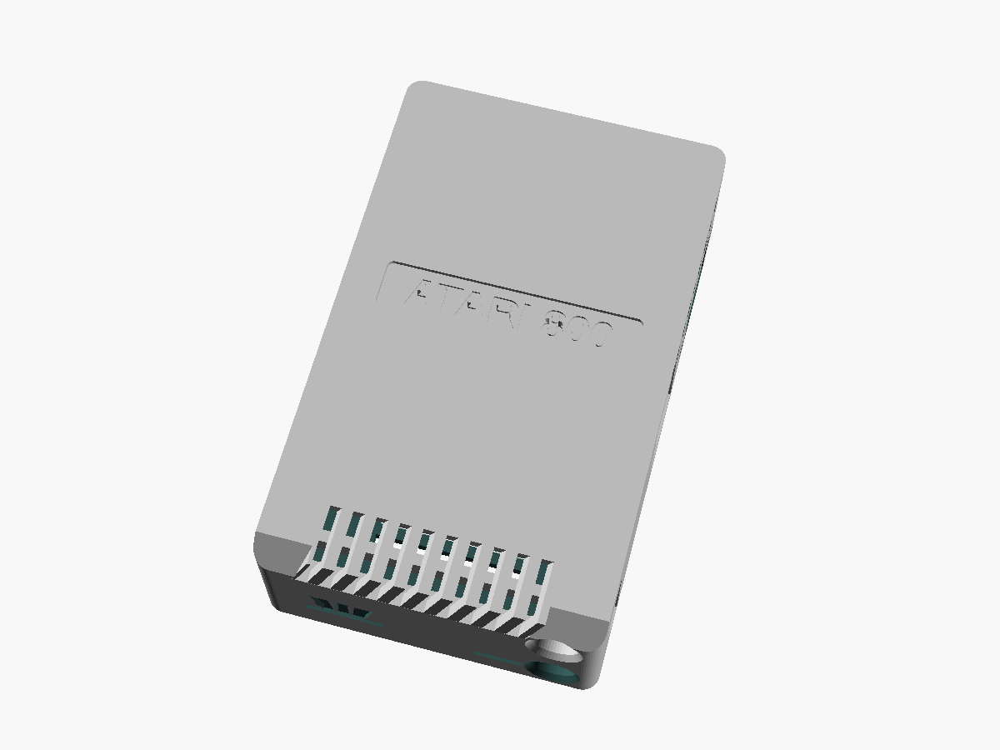
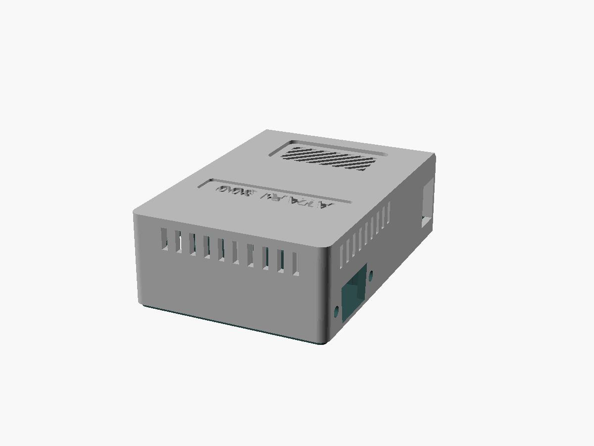
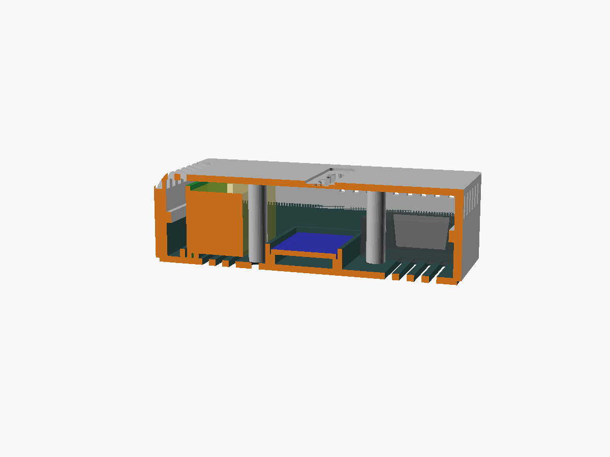
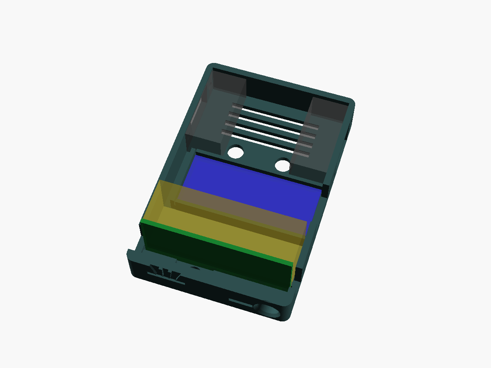
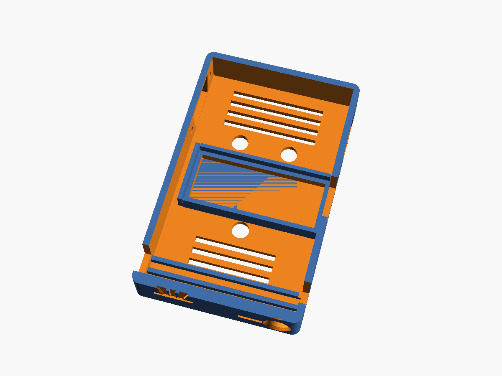
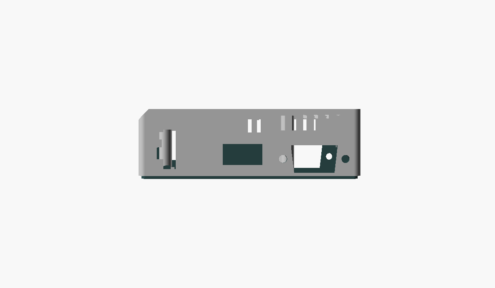
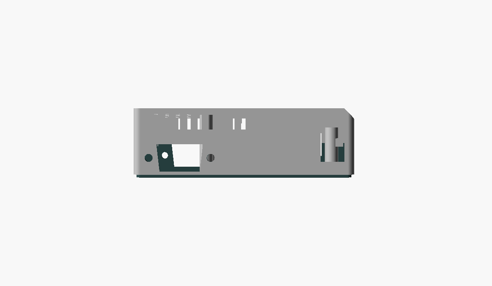
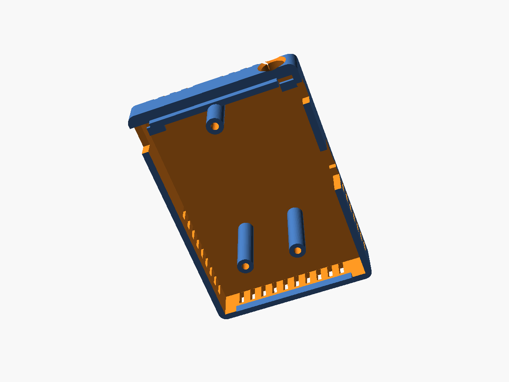
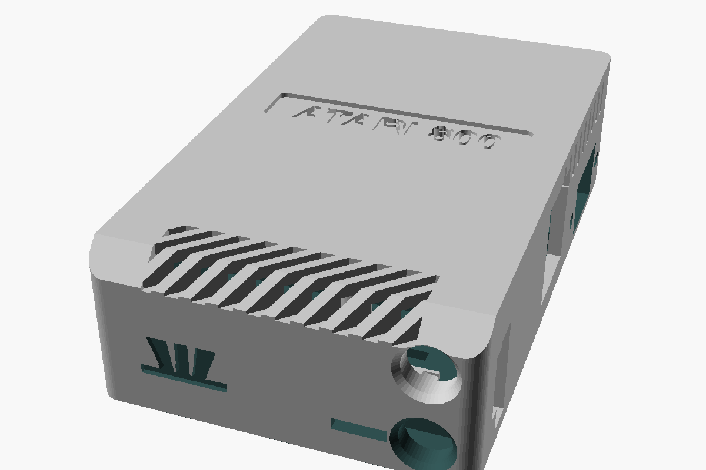

# 3D-printed case — Tang Nano 20K + CH9350

An Atari-styled clamshell enclosure for this project's hardware: a **Sipeed Tang
Nano 20K** plus a **CH9350 USB-host keyboard module**, wired as in the main
[README](../README.md) (one data wire to Pin 53, GND + 5 V, DB9 joysticks on
GPIO pins).

| | |
|---|---|
|  |  |
| Front: Fuji, LED window, button wells, comb ribs over the edge | Top: the comb wraps the front edge; branding behind it |
|  |  |
| Rear: vent grill and flank slits | Cutaway (front at left): Tang on edge, jumpers, CH9350, DB9 bay |
|  |  |
| Tray with both boards dropped in | `fitcheck` — the tray sliced at the parting line |
|  |  |
| Right: USB-C + microSD, dual USB-A (keyboard), DB9 | Left: HDMI and the other DB9 |
|  |  |
| Cover underside: screw posts, lip bars, press pads | Louvre close-up: ribs wrapping the front corner |

## The two ideas that make this work

**1. The Tang Nano stands on edge.** It sits upright behind the front panel with
its component side facing *forward*. That puts the status **LEDs and both
buttons on the front panel**, where you can see and reach them, and it turns the
GPIO headers sideways so the Dupont jumpers lie flat behind the board instead of
stacking up under the lid. The board rests on its lower long edge in a card
slot.

**2. It is a clamshell split through the connectors.** The parting line runs at
Z = 15 mm, which is *below the top of every connector that overhangs its board
edge* and *above the DB9 apertures*. Every port opening is therefore a notch
that is open at the parting line, so **both boards simply drop in from above**
and the cover closes over them. No end caps, no snap clips, nothing to fight.

## What's here

Print **two parts** (plus a cheap test), both flat on their outer face, **no
supports**:

```
case/
├── tang_nano_20k_ch9350_case.scad   # the parametric model (edit this)
├── stl/
│   ├── bottom.stl     # tray: card slot, CH9350 seat, DB9 mounts, front panel
│   ├── top.stl        # cover: vents, branding, screw posts, board press pads
│   └── fitcheck.stl   # the tray sliced low — PRINT THIS FIRST
└── img/               # rendered previews
```

Outer size: **≈ 60 × 90 × 28 mm**. The width is pinned by the Tang — its two
ends carry HDMI and USB-C, so both have to reach a side wall — and the depth is
the sum of the connector zone, the jumper stack, the CH9350 and the DB9 bay.

## ⚠️ Print `fitcheck.stl` first

`fitcheck` is the tray sliced off at the parting line: floor, card slot, CH9350
seat and the bottom half of every opening, for a fraction of the plastic. Drop
the Tang in **on edge, component side forward** and check that

1. the board seats in the card slot and stands square,
2. the HDMI / USB-C / microSD / dual-USB / DB9 openings line up,
3. the LED window and the two button wells land on the LEDs, S1 and S2.

Then adjust the variables at the top of the `.scad` (every dimension is one) and
print the real `bottom.stl` + `top.stl`.

`measure_sheet.py` regenerates `img/measure_sheet.png`, the annotated diagram of
every board dimension this model depends on — handy if you need to re-measure.

Positions come from measurements of a real board, and the connector openings are
deliberately generous — they are sized for the mating **plug**, not the bare
connector, because FDM holes print undersized (an earlier prototype had to be
opened up with a Dremel).

## Layout

Front to back: **front panel → Tang (upright) → jumper space → CH9350 → DB9 bay**.

- **Front panel** — Fuji logo, the 6-LED window, and two 8 mm wells for **S1**
  (low, on the LED line) and **S2** (high). The board sits ~6.5 mm behind the
  panel — the HDMI body sets that gap — so the wells are made wide enough to get
  a fingertip into; a pen works too.
- **Left wall** — HDMI, plus one DB9 in the rear bay.
- **Right wall** — USB-C and microSD merged into one stepped opening (so no
  fragile sliver of wall is left between them), the CH9350's **stacked dual
  USB-A** keyboard port, and the second DB9.
- **Rear wall** — ventilation grill only. Power comes in on USB-C and the
  GND / 5 V / Pin-53 links are internal jumpers, so nothing needs to leave the
  case.
- **Cooling** — an **XE-style louvre comb wraps the front-top corner**. In the
  reference the ribs are not a panel sitting on the lid: each one runs from the
  top face, over the edge, and dies into the side face, so the vent is part of
  the shell's edge rather than a window cut in the middle of it. Here that
  corner is the front-top edge, complete with its wedge chamfer — which is also
  directly over the Tang, so one feature does both the styling and the cooling.
  Every rib is held at *both* ends (to the front wall below, to the top plate
  behind), so nothing cantilevers. The comb is split into two groups by a solid
  divider where the cover's front screw post comes down — the reference's comb
  has a step in it too. Intake slots in the floor sit underneath, giving a
  chimney past the standing board; upright slits around the rear flanks and
  floor slots under the rear bay vent the back half.

### How the boards are held

- The **Tang** drops into a card slot on the floor and is pressed down by two
  pads on the cover's underside (one near each end, clear of the louvre panel). The slot is deliberately loose (3 mm for a
  1.6 mm board): the header pins sit only ~1 mm in from that edge, so their
  solder fillets reach almost to it and a tight slot would jam on solder rather
  than on bare PCB. Side-to-side travel is limited to ±0.4 mm by the walls.
- The **CH9350** sits in a shelf pocket with locating ribs on all four sides.
- The **DB9 sockets** mount entirely in the tray, so they can be screwed in
  before the cover goes on.

### Assembly

1. Wire the two DB9 sockets and screw them into the tray.
2. Drop the **Tang** into the card slot (on edge, LEDs facing the front panel)
   and the **CH9350** into its pocket.
3. Plug the Dupont jumpers onto the Tang's headers — they point backwards into
   the open bay, so this is comfortable with the cover off.
4. Lower the **cover** straight down and fasten **3 × M3 self-tapping screws
   from underneath** (one front centre, two in the rear bay) into the posts
   moulded to the cover. Nothing shows on top.

Keep the pin + Dupont stack under ~18 mm behind the PCB (`jumper_len` is 17 mm).

### DB9 joystick ports — wiring & parts

You supply **two panel-mount female DB9 connectors** (solder-cup type) and four
M3 (or #4-40) screws + nuts. Mount each socket from the inside and wire its pins
to the GPIO header per the main
[README joystick table](../README.md#atari-db9-joystick):

```
DB9 pin 1 Up    DB9 pin 3 Left   DB9 pin 4 Right   DB9 pin 6 Fire   DB9 pin 8 GND
Joy1 -> pins 27 / 28 / 29 / 30 / 31     Joy2 -> pins 32 / 41 / 42 / 48 / 77
```

All active-low; no resistors (internal FPGA pull-ups). Don't wire pin 7 (+5 V).
Set `db9_enable = false` to drop both ports and shorten the case.

## Printing

| | |
|---|---|
| Material | PLA or PETG |
| Layer height | 0.2 mm |
| Walls / top / bottom | 3 perimeters, 4 layers |
| Infill | 15–20 % |
| Supports | **none** — both shells print flat on their outer face |

Print the **cover top-face-down** (the vent slots and branding come out crisp
against the bed) and the **tray floor-down**. Every port opening is open at the
parting line, so nothing has to bridge.

## Regenerating the STLs

```sh
openscad -o stl/bottom.stl   -D 'part="bottom"'   tang_nano_20k_ch9350_case.scad
openscad -o stl/top.stl      -D 'part="top"'      tang_nano_20k_ch9350_case.scad
openscad -o stl/fitcheck.stl -D 'part="fitcheck"' tang_nano_20k_ch9350_case.scad
```

`part="assembly"`, `"section"` and `"closed"` are preview-only views.

## Credits

The styling — clamshell shells, wedge front, vent bands and split ports — is an
homage to **wt808's "Atari-Compatible eclaire Mini" enclosures**
([Thingiverse thing:3562690](https://www.thingiverse.com/thing:3562690), which
are licensed CC BY-NC-SA). **No geometry from that work is used here**: every
shape is generated from scratch by the OpenSCAD script, so this case stays under
this repository's own licence. If you want the real thing for an eclaire board,
go and print wt808's excellent models.

"Atari" and the Fuji mark are trademarks of Atari Interactive, Inc. The mark
here is a loose stylised approximation drawn in code, for personal use.
