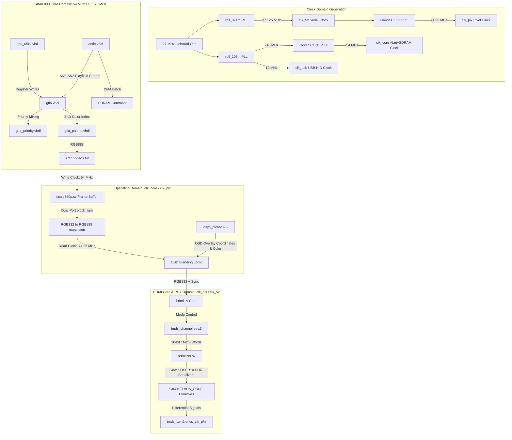

# Atari 800 to HDMI Video Pipeline Documentation

This document provides a highly technical, end-to-end trace of how video is generated, scaled, mixed, encoded, and serialized on the **Tang Nano 20K FPGA** platform running the Atari 800 core.

---

## 1. Pipeline Architecture Overview

The video chain spans three main clock domains and multiple hardware description languages (VHDL for the legacy Atari core, and SystemVerilog for the scaling, OSD mixing, and HDMI transmission).



---

## 2. Clocking and Reset Subsystem

The physical timing matches the **CEA-861 VIC 4** standard (1280x720 @ 60 Hz).

### 2.1 Clock Tree

The GW2AR-18 has exactly **2 rPLLs**.  Both are used:

| Signal | Frequency | Source | Used by |
|---|---|---|---|
| `sys_clk` | 27 MHz | On-board oscillator (pin 4) | PLL inputs, iosys, USB, audio DAC, reset timer |
| `clk_5x` | 371.25 MHz | `rpll_371m` | HDMI OSER10 serializers |
| `clk_pix` | 74.25 MHz | `clk_5x` ÷ 5 via `CLKDIV` | HDMI pixel logic, scaler read side |
| `clk_108m` | 216 MHz | `rpll_108m` CLKOUT | Intermediate for core clock |
| `clk_core` | 54 MHz | `clk_108m` ÷ 4 via `CLKDIV` | Atari core, SDRAM IP, SDRAM arbiter, scaler write side |
| `clk_usb` | 12 MHz | `rpll_108m` CLKOUTD (÷18) | USB HID host |

`rpll_108m` replaces the retired `rpll_12m` (USB clock) and the never-used
`rpll_54m`.  PLL parameters: FBDIV=7 (×8), IDIV=0, ODIV=4 →
FOUT=216 MHz, VCO=864 MHz; CLKOUTD = 216/18 = 12 MHz.

**Why 54 MHz for the Atari core?** At 27 MHz / `cycle_length=16` the SDRAM
controller needs ~20 state-machine steps × 37 ns = 740 ns per access, exceeding
the 16-cycle / 592 ns budget.  At 54 MHz / `cycle_length=32` the same 20 steps
take only 370 ns, well within the 592 ns window.  The Atari CPU speed is
unchanged: 54 / 32 = 27 / 16 = 1.6875 MHz.

### 2.2 Reset Architecture
- **`hw_reset_n`**: Released after a ~1.2 ms power-on timer AND `pll_core_locked`
  (`rpll_108m` lock), ensuring `clk_core` is stable before any logic runs.
- **`core_reset_n`**: Held low until the PicoRV32 softcore loads `OS.ROM` and
  `BASIC.ROM` from SD card into SDRAM.
- **`hdmi_rst_n`**: Gated on `hw_reset_n` and `rpll_371m` lock.

---

## 3. Atari Core Video Generation

The video generation inside the [atari800core.vhd](file:///home/carlos/devel/fpga/atari800_tang_nano20k_parallel/rtl/common/a8core/atari800core.vhd) utilizes the classic chip-register division: ANTIC for screen layout and DMA; GTIA for sprites, priority resolving, and color generation.

### 3.1 ANTIC Display Processor ([antic.vhdl](file:///home/carlos/devel/fpga/atari800_tang_nano20k_parallel/rtl/common/a8core/antic.vhdl))
ANTIC acts as a specialized DMA controller and screen raster generator:
1. **Instruction Fetch**: It fetches instruction tokens (the *Display List*) from SDRAM. These instructions specify the text or graphic modes for subsequent scanlines, and whether horizontal/vertical scrolling or DMA is active.
2. **Data Fetch**: Depending on the display mode, ANTIC asserts `dma_fetch_out` and fetches character indices, character generator fonts, or raw bitmap bits from SDRAM.
3. **The AN Bus**: ANTIC decodes the graphics or character generator patterns and streams playfield tokens to GTIA over the three-bit `AN` bus (`AN0`, `AN1`, `AN2`) at color-clock boundaries.

### 3.2 GTIA & Priority Mixing ([gtia.vhdl](file:///home/carlos/devel/fpga/atari800_tang_nano20k_parallel/rtl/common/a8core/gtia.vhdl))
GTIA receives ANTIC's pixel data, mixes it with sprites, determines priorities, and formats the output color index:
1. **Sprite Rendering**: GTIA tracks the vertical/horizontal positions of 4 Players and 4 Missiles (sprites) and generates active signals when the raster coordinates intersect their shapes.
2. **ANTIC Stream Decoding**: GTIA processes the `AN` bus:
   - **Normal Mode**: Maps `AN(2:0)` to background (`BK`), playfield 0 (`PF0`), playfield 1 (`PF1`), playfield 2 (`PF2`), and playfield 3 (`PF3`).
   - **GTIA Modes (Modes 9, 10, 11)**: Reads `AN` signals over two color clocks to reconstruct 4-bit indices. Mode 9 allows 16 shades of one hue; Mode 10 allows 9 independent colors; Mode 11 allows 16 distinct hues at a fixed luminance.
3. **Priority Resolving**: The module [gtia_priority.vhdl](file:///home/carlos/devel/fpga/atari800_tang_nano20k_parallel/rtl/common/a8core/gtia_priority.vhdl) implements the hardware priority encoder configured by the `PRIOR` register. The combinatorial logic evaluates mask lines (`SP0-SP3`, `SF0-SF3`, `SB`) to determine whether a sprite or a playfield layer takes precedence:
   ```vhdl
   SP0 <= P0 and not (PF01 and PRI23) and not (PRI2 and PF23);
   SP1 <= P1 and not (PF01 and PRI23) and not (PRI2 and PF23) and (not P0 or MULTI);
   SF0 <= PF0 and not (P23 and PRI0) and not (P01 and PRI01) and not SF3;
   ```
4. **Index Selection**: Based on the active prioritized mask (e.g., `set_bk`, `set_pf0`, `set_p0`), GTIA selects the corresponding 8-bit color register value (which the 6502 CPU writes to GTIA registers `$D012`–`$D01A`):
   ```vhdl
   colour_next <= (
       (colbk_snap_reg(7 downto 0) and mask_bk) or
       (GTIA_PF0(7 downto 0) and mask_pf0) or
       (colpm0_snap_reg(7 downto 0) and mask_p0) -- etc.
   );
   ```

### 3.3 Palette Conversion ([gtia_palette.vhdl](file:///home/carlos/devel/fpga/atari800_tang_nano20k_parallel/rtl/common/a8core/gtia_palette.vhdl))
The 8-bit color index (`COLOUR`) consists of a 4-bit Hue (high nibble) and a 4-bit Luminance (low nibble). The VHDL entity `gtia_palette` performs a ROM-based translation mapping each of the 256 colors to modern RGB888 format (based on the standard Altirra palette mapping):
- **Hue 0 (Grayscale)**: Maps directly to identical R, G, B values matching the luminance.
- **Hues 1–15**: Maps to specific phase-shifted chroma profiles (e.g., Hue 1 is Gold, Hue 2 is Orange, Hue 15 is Yellow-Green).

---

## 4. Upscaling and Ping-Pong Line Buffers

Because the Atari core outputs standard-definition video at color clock rates (~7.16 MHz) and HDMI requires a 74.25 MHz pixel clock, the module [scale720p.sv](file:///home/carlos/devel/fpga/atari800_tang_nano20k_parallel/src/scale720p.sv) acts as a scan-converter and upscaler. Rather than using a full frame buffer (which introduces frames of latency and exceeds memory budgets), it implements a 512-byte ping-pong line buffer system utilizing an inferred True Dual-Port Block RAM.

### 4.1 Write Domain (54 MHz `clk_core`)
1. **Color Quantization**: To conserve block RAM, incoming 24-bit RGB888 is packed into 8-bit **RGB332** format:
   ```systemverilog
   din_a <= {r_in[7:5], g_in[7:5], b_in[7:6]};
   ```
2. **Ping-Pong Buffer Selection**:
   - `wr_buf_idx` (1 bit) points to the buffer currently being written. It resets to `0` at the start of a frame (`vs_in` rising edge) and toggles (`~wr_buf_idx`) at the falling edge of `de_in` (end of each Atari active scanline).
   - Write address is `{wr_buf_idx, wr_col}`, where `wr_col` resets to 0 when `de_in` is low and increments up to 255 on active pixels.
3. **RAM Write**: A dual-port write updates the active buffer page inside the true dual-port RAM:
   ```systemverilog
   .addr_a({wr_buf_idx, wr_col}),
   .we_a  (de_in && pixce_1x)
   ```

### 4.2 Read Domain (74.25 MHz `clk_pixel`)
1. **Genlock Frame Alignment (Monotonic Sequential Timing)**:
   - The Atari's `vs_in` signal is synchronized to the `clk_pixel` domain.
   - To prevent horizontal sync jitter and monitor lock loss, the horizontal counter `hx` is free-running and never truncated (preserving the standard 45.0 kHz horizontal frequency).
   - On the falling edge of the synchronized VSync (`vs_in_sync_fall`), a `vs_pending` flag is set high.
   - To avoid any double sync pulses or glitches, the vertical counter `vy` is kept strictly monotonic: it increments sequentially and resets to `0` at the end of the line (`hx == H_TOTAL - 1`) immediately when `vs_pending` is high.
   - This locks the vertical refresh rate of the HDMI signal to the Atari core frame rate (NTSC ~59.92 Hz orPAL ~50.0 Hz).
2. **Buffer Swap & Latency Control**:
   - The active write buffer index is synchronized to the read clock domain (`wr_buf_idx_sync`).
   - The read buffer index `rd_buf_idx` selects the page containing the most recently completed line (`~wr_buf_idx_sync`).
   - To prevent tearing and image glitches, `rd_buf_idx` is only updated at the end of the 3-line HDMI group repetition (`hx == H_TOTAL - 1 && line_rep_cnt == 2`).
3. **Timing Alignment and Collision Avoidance**:
   - Because `vy` resets to `0` at the end of the Atari VSync pulse, `vy = 0` corresponds to the start of the Atari vertical back porch (16 Atari lines / 48 HDMI lines for NTSC).
   - To align the active regions and avoid memory access collisions, the active HDMI video start is shifted to `vy >= 51` (`V_ACTIVE_START = 51`), giving the Atari write pointer a safe 1-line head start.
   - The active HDMI video window is defined as `51 <= vy < 771` (exactly 720 lines), and the vertical sync pulse is generated at `775 <= vy < 780` (exactly 5 lines).
   - This shifted vertical structure is strictly sequential within `vy = 0..785` (for a 786-line NTSC frame) before wrapping, eliminating any timing discontinuities:
     ```systemverilog
     wire de_s0 = (hx < H_ACTIVE) && (vy >= 10'd51) && (vy < 10'd771);
     wire vs_s0 = (vy >= 10'd775) && (vy < 10'd780);
     ```
4. **Division-Free Scaling**:
   - **Horizontal (5x stretch)**: A modulo-5 counter `pix_rep_cnt` drives `rd_col` (0..255) horizontally.
   - **Vertical (3x stretch)**: A modulo-3 counter `line_rep_cnt` manages vertical repetition. A read row register `rd_row` increments by 1 every 3 HDMI lines (when `line_rep_cnt == 2` and `hx == H_TOTAL - 1`) during active lines.
5. **Synchronous Read Latency Pipelining**:
   - True Dual-Port Block RAM has a synchronous read latency of 1 clock cycle.
   - Coordinates (`rd_col`) are registered inside Stage 0. The RAM outputs `rd_data` at Stage 2.
   - To align control signals, `de`, `hs`, and `vs` are delayed through a 2-stage pipeline (`de_p1` -> `de_p2`, etc.), matching the BRAM output latency exactly.
   - The final video signals are output combinatorially from the Stage 2 registered pipeline:
     ```systemverilog
     r_out = de_p2 ? {rd_data[7:5], rd_data[7:5], rd_data[7:6]} : 8'd0;
     ```

---

## 5. OSD Overlay Mixing

The OSD menu system runs in the `clk_pix` domain.
1. The RISC-V PicoRV32 softcore (`iosys_picorv32.v`) outputs overlay data at the active raster coordinates (`osd_x`, `osd_y` provided by the scaler).
2. If `overlay` is asserted and `overlay_color` is non-black (non-transparent), an OSD active flag is raised:
   ```systemverilog
   wire osd_active = overlay && (overlay_color[14:0] != 15'd0) && hdmi_de;
   ```
3. The BGR555 overlay color is expanded to RGB888:
   ```systemverilog
   wire [7:0] osd_r = {overlay_color[4:0],   overlay_color[4:2]};
   wire [7:0] osd_g = {overlay_color[9:5],   overlay_color[9:7]};
   wire [7:0] osd_b = {overlay_color[14:10], overlay_color[14:12]};
   ```
4. A multiplexer swaps the scaler outputs with the OSD color:
   ```systemverilog
   wire [7:0] mixed_r = osd_active ? osd_r : hdmi_r;
   ```
5. These values are pipelined to registers (`mixed_r_reg`, etc.) to eliminate long combinational routing delays to the TMDS encoders.

---

## 6. HDMI Encoding and Packetization

The wrapped core [hdmi.sv](file:///home/carlos/devel/fpga/atari800_tang_nano20k_parallel/src/hdmi2/hdmi.sv) handles audio integration, HDMI packet formatting, and TMDS symbol mapping.

### 6.1 Audio Integration ([hdmi_audio_out.sv](file:///home/carlos/devel/fpga/atari800_tang_nano20k_parallel/src/hdmi_audio_out.sv))
1. **Sampling Rate**: An accumulator divides `clk_pix` (74.25 MHz) to generate a precise 48 kHz strobe `smp_tick`:
   ```systemverilog
   smp_acc <= smp_tick ? (smp_acc + 8 - 12375) : (smp_acc + 8);
   ```
2. **Audio Sample Mapping**: Left and right 16-bit PCM channels from the Pokey/Covox cores are latched on `smp_tick` and packed into standard subpackets.
3. **HDMI Core Frame Synchronization and Decoupled Resets**:
   - Sameer Puri's `hdmi` core generates horizontal and vertical timing coordinates (`cx`/`cy`) internally based on the hardcoded video standard parameters.
   - To keep the HDMI transmitter's internal coordinates aligned with the scaled video output of `scale720p`, the wrapper `hdmi_audio_out` generates a 1-cycle reset pulse at the first active pixel of every frame (detected when `de` goes high after `vs` was high).
   - **Critical Reset Separation**: The `hdmi` core contains a high-speed `serializer` module utilizing Gowin `OSER10` primitives. Resetting these serializers dynamically every frame disrupts TMDS symbol alignment and clock lock, causing total video drop. Therefore, a separate `serializer_reset` is routed specifically to the physical serializers, connected to the stable system-wide active-high reset (`!rst_n`), while the dynamic 1-cycle reset is routed exclusively to the coordinate counters and packet processors.
   - This ensures the pixel stream and the HDMI core's transmission periods (active video vs blanking/islands) are perfectly locked in phase on every single frame, eliminating any drift or vertical rolling of the picture and OSD menu, without interrupting the physical TMDS clock and data link.

### 6.2 HDMI Protocol Periods
HDMI divides the transmission stream into three distinct functional periods:
1. **Video Data Period (Mode 1)**: Transmitted when `de` is active. Raw RGB888 pixels are mapped directly.
2. **Data Island Period (Mode 3)**: Transmitted during horizontal/vertical blanking intervals. It carries audio sample packets (holding up to 4 audio channels), Audio Clock Regeneration (ACR) packets (transmitting $N$ and $CTS$ parameters), and AVI InfoFrames.
3. **Control Period (Mode 0)**: Transmitted when no active data or island is present. Only HSYNC and VSYNC signals are passed.
4. **Guard Bands (Modes 2 & 4)**: 2-character preambles inserted at the start and end of Video and Data Islands to prevent bit-transition noise and aid receiver synchronization.

### 6.3 TMDS Encoder ([tmds_channel.sv](file:///home/carlos/devel/fpga/atari800_tang_nano20k_parallel/src/hdmi2/tmds_channel.sv))
The three color channels (Channel 0: Blue/Sync, Channel 1: Green/Audio, Channel 2: Red/Audio) encode 8-bit inputs into 10-bit symbols to preserve DC balance and guarantee sufficient clock transition density.

1. **Transition Minimization (Video Mode 1)**:
   The encoder evaluates the number of bit transitions in the input byte. It applies either cumulative XOR or XNOR encoding, outputting a 9-bit word `q_m` where the 9th bit signifies the method used.
2. **DC Balancing (Disparity Tracking)**:
   An accumulator tracking the running disparity (`acc`) determines whether to invert the lower 8 bits of the 9-bit word `q_m` to pull the signal back toward a 0-bias state. The final 10th bit (`q_out[9]`) is set to high if inversion occurred.
3. **TERC4 Encoding (Data Island Mode 3)**:
   Data Island auxiliary data is encoded using **Transition-Minimized 4-bit (TERC4)** mapping. This maps 4-bit values into highly balanced 10-bit symbols to maximize noise immunity:
   ```systemverilog
   case(data_island_data)
       4'b0000 : tmds <= 10'b1010011100;
       4'b0001 : tmds <= 10'b1001100011;
       -- (etc.)
   ```
4. **Control Encoding (Control Mode 0)**:
   Control bits (like HSYNC/VSYNC) are mapped directly to high-transition 10-bit symbols (e.g., `10'b1101010100`).

---

## 7. Serialization and PHY Output

The final serialization and differential signal driving are achieved through hardware-specific Gowin FPGA primitives.

### 7.1 Serializer ([serializer.sv](file:///home/carlos/devel/fpga/atari800_tang_nano20k_parallel/src/hdmi2/serializer.sv))
The parallel 10-bit TMDS words must be transmitted serially at $10\times$ the pixel clock rate (742.5 Mbps per lane).
1. **OSER10 Primitives**: The module instantiates three Gowin `OSER10` (10:1 Output Serializer) hardware macros, one for each TMDS lane:
   ```systemverilog
   OSER10 gwSer0 (
       .Q(tmds[0]),
       .D0(tmds_internal[0][0]),
       .D1(tmds_internal[0][1]),
       .D2(tmds_internal[0][2]),
       .D3(tmds_internal[0][3]),
       .D4(tmds_internal[0][4]),
       .D5(tmds_internal[0][5]),
       .D6(tmds_internal[0][6]),
       .D7(tmds_internal[0][7]),
       .D8(tmds_internal[0][8]),
       .D9(tmds_internal[0][9]),
       .PCLK(clk_pixel),
       .FCLK(clk_pixel_x5),
       .RESET(reset)
   );
   ```
2. **Clocking Phase**:
   - `PCLK` = `clk_pixel` (74.25 MHz) clocks the parallel loading phase.
   - `FCLK` = `clk_pixel_x5` (371.25 MHz) clocks the serial output phase. By utilizing **Double Data Rate (DDR)** clocking, `OSER10` serializes 2 bits per `FCLK` cycle, achieving the required $10:1$ serialization ratio.

### 7.2 Differential Physical Drivers (`TLVDS_OBUF`)
The serialized single-ended signals (`tmds[2:0]`) and the pixel clock (`clk_pixel`) are passed to the Gowin physical output buffers:
```systemverilog
TLVDS_OBUF tlvds_d0  (.I(tmds_internal[0]),   .O(tmds_p[0]),   .OB(tmds_n[0]));
TLVDS_OBUF tlvds_d1  (.I(tmds_internal[1]),   .O(tmds_p[1]),   .OB(tmds_n[1]));
TLVDS_OBUF tlvds_d2  (.I(tmds_internal[2]),   .O(tmds_p[2]),   .OB(tmds_n[2]));
TLVDS_OBUF tlvds_clk (.I(tmds_clock_internal),.O(tmds_clk_p), .OB(tmds_clk_n));
```
These primitives convert the internal CMOS logic level signals into standard high-speed low-voltage differential signals (LVDS/TMDS electrical levels) to drive the physical HDMI pins.
